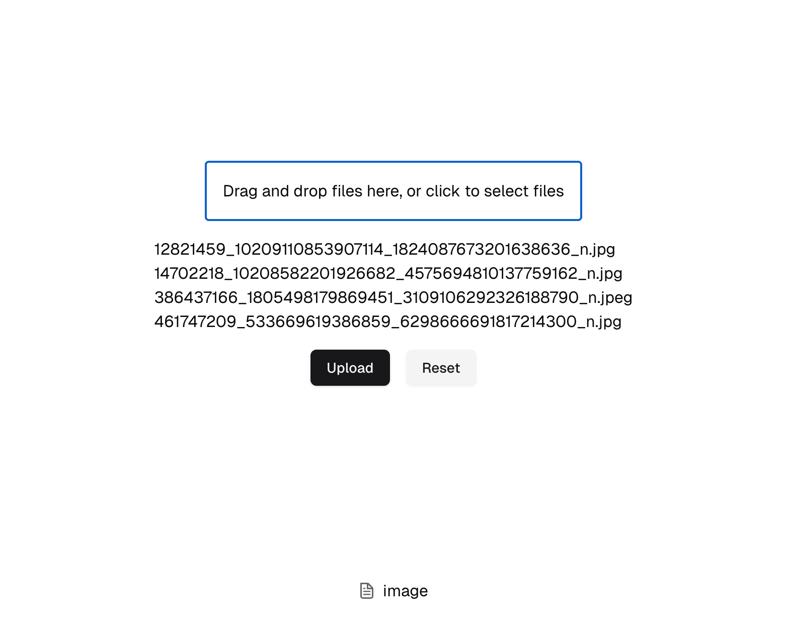
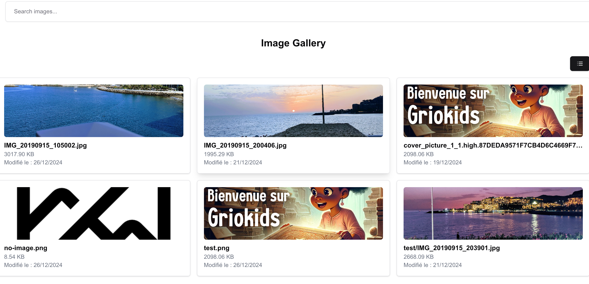
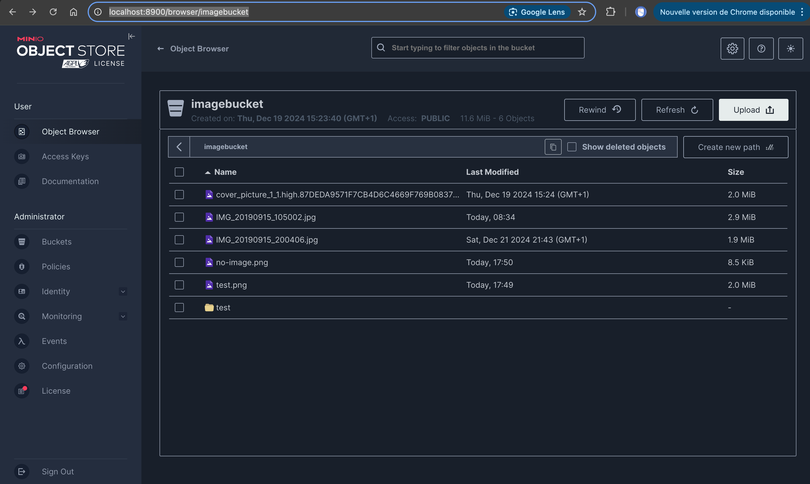

This is a [Next.js](https://nextjs.org) project bootstrapped with [`create-next-app`](https://nextjs.org/docs/app/api-reference/cli/create-next-app).

Basic upload multi images on Docker S3 minio aka (AWS S3)

[Minio Js Dock](https://min.io/docs/minio/linux/developers/javascript/minio-javascript.html)

### Screenshot







## Getting Started

First, run the development server:

```bash
npm run dev
# or
yarn dev
# or
pnpm dev
# or
bun dev
```

### - Environment Variables

```text
AWS_ACCESS_KEY_ID=minio_login_OR_access_key_id
AWS_SECRET_ACCESS_KEY=minio_password_OR_secret_key
AWS_DEFAULT_REGION=eu-east-1
AWS_BUCKET_NAME=name_of_your_bucket
AWS_BUCKET_IMAGE_URL=http://localhost:9000/name_of_your_bucket/
AWS_SHARE_TMP_URL=http://localhost:8900/api/v1/download-shared-object/
AWS_ENDPOINT=localhost
AWS_PORT=9000
AWS_USE_PATH_STYLE_ENDPOINT=true
```

### - Docker

[Minio Docker image](https://hub.docker.com/r/minio/minio)

Start minio server

```bash
docker compose up
```

Stop minio server

```bash
docker compose down
```

### - Make

Start nextjs app dev mode

```bash
make dev
```

Start nextjs app

```bash
make start
```

Build nextjs app

```bash
make build
```

Stop minio

```bash
make minio
```

Stop minio

```bash
make stop_minio
```

Open [http://localhost:3000](http://localhost:3000) with your browser to see the result.

You can start editing the page by modifying `app/page.tsx`. The page auto-updates as you edit the file.

This project uses [`next/font`](https://nextjs.org/docs/app/building-your-application/optimizing/fonts) to automatically optimize and load [Geist](https://vercel.com/font), a new font family for Vercel.

## Learn More

To learn more about Next.js, take a look at the following resources:

- [Next.js Documentation](https://nextjs.org/docs) - learn about Next.js features and API.
- [Learn Next.js](https://nextjs.org/learn) - an interactive Next.js tutorial.

You can check out [the Next.js GitHub repository](https://github.com/vercel/next.js) - your feedback and contributions are welcome!

## Deploy on Vercel

The easiest way to deploy your Next.js app is to use the [Vercel Platform](https://vercel.com/new?utm_medium=default-template&filter=next.js&utm_source=create-next-app&utm_campaign=create-next-app-readme) from the creators of Next.js.

Check out our [Next.js deployment documentation](https://nextjs.org/docs/app/building-your-application/deploying) for more details.
